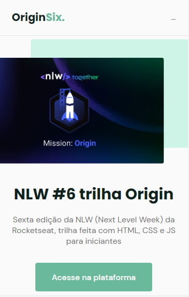

## NLW_Together_Origin 
[https://tommattih.github.io/NLW_Together_Origin/](https://tommattih.github.io/NLW_6_Together_Origin/)

### Projeto baseado na trilha Origin da 6# Next Level Week da Rocketseat
**Dia 1**
* Entendimento do layout no [Figma](https://www.figma.com/community/file/1009807319507822993/Origin-Six)
* Criação da primeira parte do HTML

  -> Barra de navegação fixa
  
  -> Conteúdo principal com imagem
  
  -> Botão de navegação
  
  -> Separação de blocos
  
* Criação de _Classes_ e _ID's_
* Estilização com CSS
* Criação de variáveis

---

